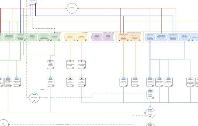

# NHS Data Architecture & Data Flows

Functional, comprehensive, and understandable schematics for NHS England data architecture. This repo contains the source files for [d3london.github.io/nhs_data_architecture](https://d3london.github.io/nhs_data_architecture).

As of August 2024, the information hosted on the website are still basic and incomplete. We are reaching out to the community to feed back and help make this resource better. Please get in touch through [this form](https://forms.office.com/e/GjThQRhuSg).

- [Dr. Joe Zhang](https://www.linkedin.com/in/drjzhang/)
- [Dr. Jess Morley](https://www.linkedin.com/in/jessicarosemorley/)
- [Oliver Large](https://www.institute.global/experts/oliver-large)
- [Prof. James Teo](https://www.linkedin.com/in/prof-james-teo-12158313/)

Working with:

