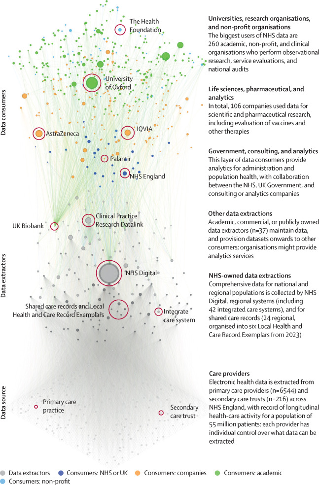
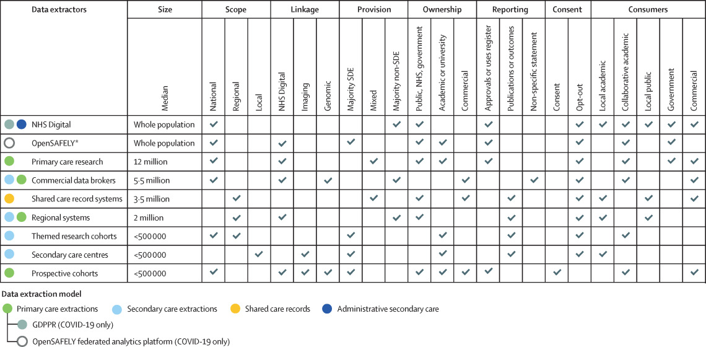

# NHS Data Architecture & Data Flows

Functional, comprehensive schematics for NHS England data architecture. This repo contains the source files for [d3london.github.io/nhs_data_architecture](d3london.github.io/nhs_data_architecture).

Previous work in mapping data flows found in [Zhang, Morley et al., 2023](https://www.thelancet.com/journals/landig/article/PIIS2589-7500(23)00157-7/fulltext) and [Data Insights UK](https://datainsights.uk). This last work, conducted to support recommendations of [Better, Broader, Safer 2022](https://www.gov.uk/government/publications/better-broader-safer-using-health-data-for-research-and-analysis), was focused on high-level but comprehensive understanding of what individual flows existed (est. 60,000 in one year) and who was extracting and using data. The new work, hosted here, is focused on a cross-section of systems, technical architectures, and extraction mechanisms, that are key to informing feasibility and gap anlysis for technical data programmes.         

